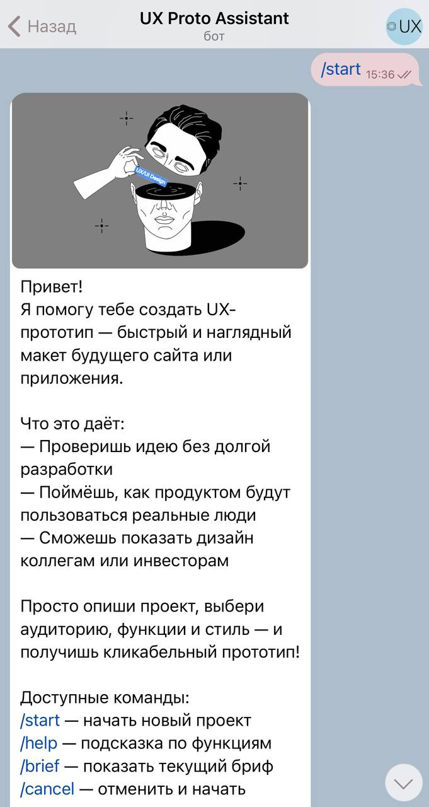
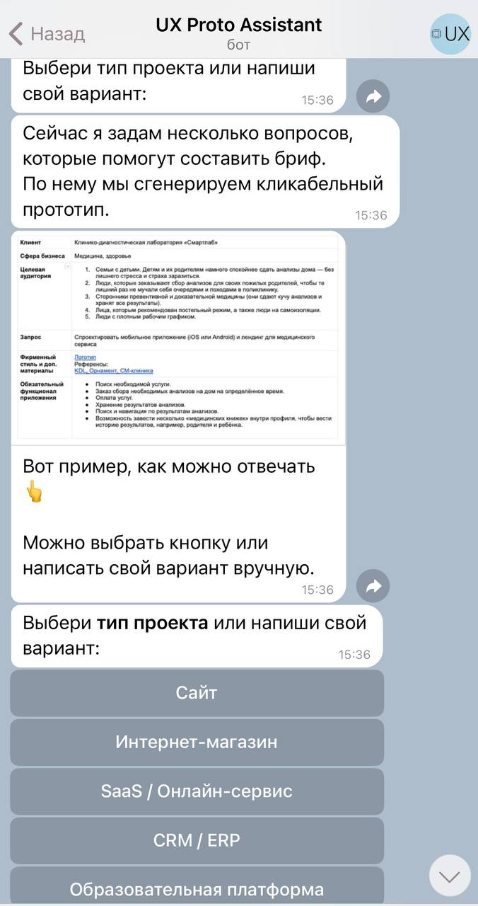
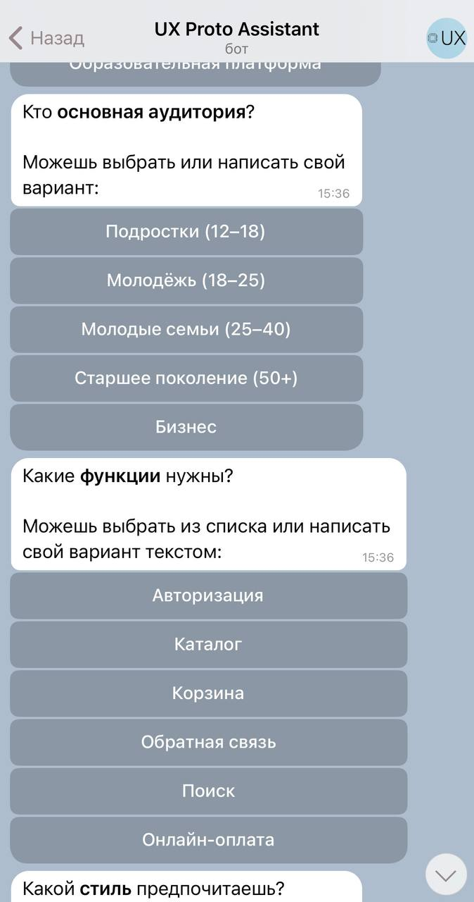
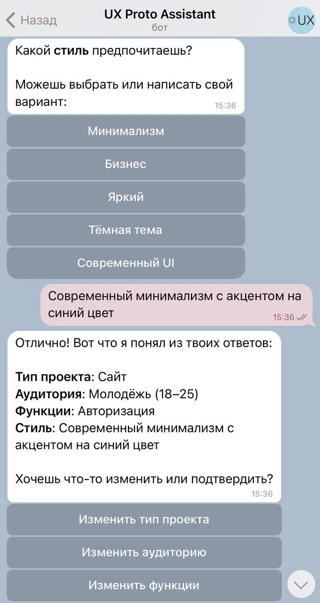
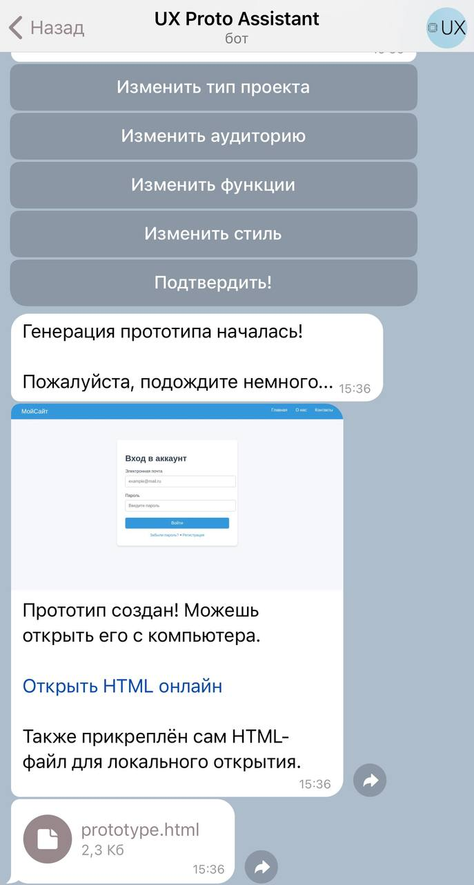
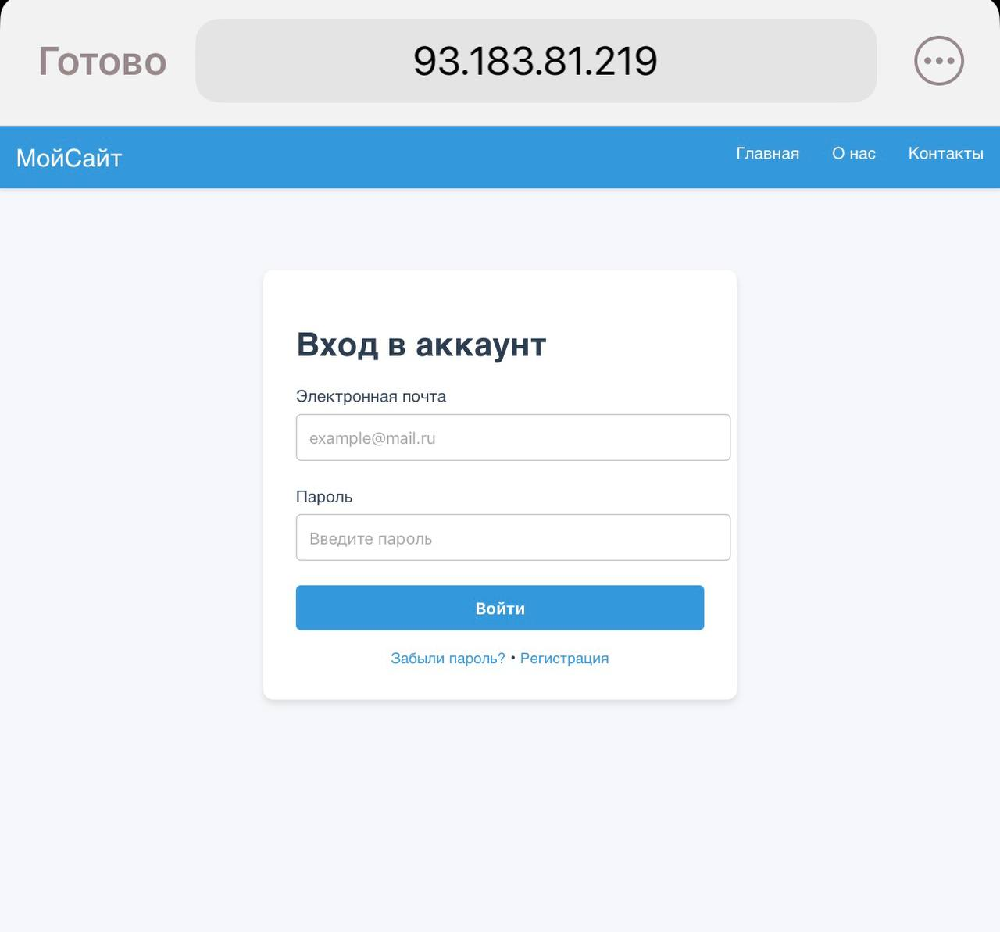

# Uxdraft Bot  

[](https://www.docker.com/)  
[](https://www.python.org/)  
[](https://fastapi.tiangolo.com/)  
[](https://core.telegram.org/bots)  
[](LICENSE)  

**Telegram-бот, который строит кликабельный UX/UI-прототип из *user story***  

> Бот задаёт пользователю вопросы, собирает user story / пользовательские сценарии и на их основе генерирует кликабельный HTML-прототип (UX/UI).  

🔗 **Демо**: @uxdraft_bot 

📖 Про user story: [Яндекс Практикум — что такое user story](https://practicum.yandex.ru/blog/chto-takoe-polzovatelskie-scenarii-i-dlya-chego-ih-nuzhno-stroit/)  
🎨 Про UX/UI: [Яндекс Практикум — обзор](https://practicum.yandex.ru/blog/chto-takoe-ux-ui-dizayn/)  

---

## Что делает проект?

- В Telegram пользователь отвечает на серию вопросов (тип проекта, аудитория, функции, стиль).  
- Бот формирует структурированную **user story** и передаёт её на сервер.  
- **FastAPI**-сервис генерирует **кликабельный HTML-прототип** по шаблонам из `templates/` → результат в `output/`.  
- Прототип можно открыть в браузере и быстро прогнать сценарии/гипотезы.

- Uxdraft Bot упрощает старт:
1. Сбор информации — бот задаёт пользователю структурированные вопросы (тип проекта, целевая аудитория, ключевые функции, стилистика, пожелания).
2. Формирование user story — ответы автоматически превращаются в сценарии, которые отражают, как пользователи будут взаимодействовать с продуктом.
3. Генерация прототипа — сервер (FastAPI) рендерит HTML-страницы по шаблонам, размещая элементы на странице в логически правильном порядке (UX-дизайн).
4. Кликабельный результат — готовый прототип сохраняется в output/ и доступен по ссылке. Его можно открыть в браузере, проверить гипотезы и прогнать сценарии.
5. Дальнейшая доработка — при необходимости можно открыть HTML-код, поправить расположение блоков или стили и использовать как основу для полноценного интерфейса.

Uxdraft Bot снимает порог входа в UX/UI-дизайн: даже без специальных навыков можно быстро «пощупать» будущее приложение или сайт, протестировать идеи и показать их команде или заказчику.

---

## Технологии

- Python 3.11  
- [aiogram](https://docs.aiogram.dev) — Telegram-бот (`bot`)  
- [FastAPI](https://fastapi.tiangolo.com/) — API и генерация HTML-прототипа (`server`)  
- Jinja2 / HTML-шаблоны — рендер прототипов  
- Docker + docker-compose — упаковка и запуск стека  
- [Playwright](https://playwright.dev) *(опционально)* — автопроверки / снятие превью  
- OpenRouter API *(опционально)* — LLM-подсказки (`OPENROUTER_API_KEY`)  
- [Ollama](https://ollama.ai) *(опционально)* — локальная LLM (`init_ollama.sh`)  

---

## Структура репозитория

```
Uxdraft_bot/
├─ assets/                 # статические ресурсы (иконки, стили, скриншоты)
├─ bot/                    # код Telegram-бота
├─ services/               # фоновые сервисы (например, очистка output)
├─ output/                 # сгенерированные HTML-прототипы
├─ templates/              # HTML-шаблоны страниц
├─ Dockerfile.bot          # образ для бота
├─ Dockerfile.server       # образ для FastAPI
├─ docker-compose.yml      # стэк bot + server
├─ server.py               # точка входа FastAPI
├─ config.py               # конфигурация
├─ prompts.yaml            # сценарии вопросов для бота
├─ requirements.txt        # зависимости Python
└─ init_ollama.sh          # запуск локальной LLM (опционально)
```

---

## Переменные окружения

Создайте `.env` в корне проекта:  

```env
# Telegram
BOT_TOKEN=YOUR_TELEGRAM_BOT_TOKEN

# Ссылки/хосты
WEB_HOST=0.0.0.0
WEB_PORT=8000
PUBLIC_HOST=https://your-domain.ru
SERVER_URL=https://your-domain.ru

# Директории/шаблоны
OUTPUT_DIR=output
TEMPLATES_DIR=templates
MAIN_TEMPLATE=page_base.html

# Очистка мусора
CLEANUP_RETENTION_SECONDS=3600
CLEANUP_INTERVAL_SECONDS=600

# LLM (опционально)
OPENROUTER_API_KEY=sk-or-************************
OPENROUTER_MODEL=anthropic/claude-3.5-sonnet
```

---

## Быстрый старт (Docker)

```bash
# 1) Клонируйте проект
git clone https://github.com/dievavar/Uxdraft_bot.git
cd Uxdraft_bot

# 2) Создайте .env (см. пример выше)

# 3) Соберите и запустите контейнеры
docker compose build
docker compose up -d

# 4) Проверка
docker ps

# server слушает 0.0.0.0:8000 внутри сети
# открыть прототип: https://your-domain.ru
# проверить бота: /start в Telegram
```

---

## Локальный запуск (без Docker)

```bash
# Создать виртуальное окружение
python3.11 -m venv .venv && source .venv/bin/activate
pip install -r requirements.txt

# Запуск FastAPI
export $(cat .env | xargs)
python server.py
# или uvicorn server:app --reload --host 0.0.0.0 --port 8000

# Запуск бота
python -m bot.main
```

---

## Как это работает?

1. **Диалог с ботом** — по `prompts.yaml` собираются требования в формате user story.  
2. **FastAPI** рендерит HTML по шаблонам (`templates/`) и сохраняет результат в `output/`.  
3. **LLM** (через OpenRouter/Ollama) может подсказывать тексты и формулировки.  
4. **Сервис очистки** удаляет старые прототипы по TTL.  

---

## Скриншоты и демо

### GIF-демо


### Скриншоты. Пример использования:







## Полезные команды

```bash
# Перезапуск после изменений
docker compose up -d --build

# Логи
docker compose logs -f server
docker compose logs -f bot

# Остановка
docker compose down
```

---

## Roadmap

- Поддержка webhook для Telegram  
- История сессий и личные кабинеты  
- Экспорт прототипов в ZIP/Single-File HTML  
- Дополнительные темы шаблонов  
- Генерация user story map и визуализация флоу  

---

## Безопасность

- Не коммитьте секреты (`BOT_TOKEN`, `OPENROUTER_API_KEY`)  
- Используйте `.env` и секреты CI/CD  
- Автоочистка `output/` при публичном деплое обязательна  

---
